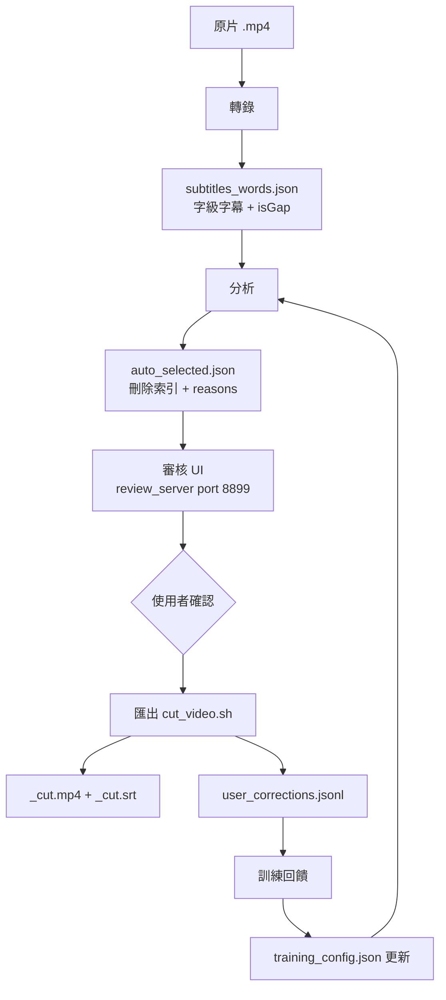

# 剪口播 — Pipeline 架構設計

## 全局資料流



---

## 各階段說明

### 階段 1：轉錄

**輸入**：`audio.mp3`
**輸出**：`subtitles_words.json`（字級字幕陣列）

主要路徑：`google_transcribe.py` → Google Cloud STT（zh-TW 原生繁體）
備用路徑：`whisper_transcribe.sh` → ffmpeg VAD 分段 → Whisper 各段 → 合併時間戳

`subtitles_words.json` 格式：
```json
[
  {"text": "大", "start": 0.12, "end": 0.20, "isGap": false},
  {"text": "",   "start": 6.78, "end": 7.48, "isGap": true}
]
```
每個元素是「字」或「靜音段」，idx 即陣列位置，全 pipeline 以 idx 操作。

**為何以字為單位（而非以句）**：剪輯精度到幀級，需要字的時間戳；句子邊界在分析階段才推斷，而非轉錄時固定。

---

### 階段 2：分析

**輸入**：`subtitles_words.json` + `training_config.json` + `用戶習慣/`
**輸出**：`auto_selected.json`

分析分兩層：
1. **規則層**（`auto_select_rules.js`）：靜音 ≥ threshold 直接標記
2. **AI 層**（`ai_cut_pairs.js`）：候選對模式，讀最近 5 筆 `user_corrections.jsonl` 做 few-shot，判斷重複/殘句/口誤

`auto_selected.json` 支援兩種格式（向下兼容）：
- 簡單格式：`[72, 85, 120]`
- 帶理由格式：`{"indices": [...], "reasons": {"72": "靜音≥1s", "200-203": "殘句"}}`

**為何候選對模式（而非逐字掃描）**：大幅減少 AI token 消耗（候選對通常 ≤ 30 組），同時保留上下文讓 AI 判斷更準確。

---

### 階段 3：審核 UI

**輸入**：`subtitles_words.json` + `auto_selected.json` + 原片（符號連結）
**輸出**：使用者修改後的 `userSelected`

`review_server.js` 提供：
- `GET /api/waveform` — ffmpeg astats 產生 RMS 陣列，前端 canvas 繪波形
- `POST /api/execute-cut` — 收 `userSelected`，觸發剪輯
- `GET /api/protected-words` / `POST` — 保護詞清單 CRUD
- `POST /api/srt-reverse-align` — 反向 SRT 對齊

**為何必須用 review_server.js（不能 python http.server）**：影片播放需要 HTTP 206 Range 請求，python 簡易服務器不支援。

---

### 階段 4：匯出

**輸入**：`userSelected`（JSON 陣列）+ `subtitles_words.json`
**輸出**：`_cut.mp4` + `_cut.srt` + `user_corrections.jsonl`（diff 記錄）

`cut_video.sh` 工作流：
1. 偵測原片 codec/profile/pix_fmt/bitrate
2. 並行分段提取 → concat demuxer 無損拼接
3. 以原片相同參數重編碼（NVENC 優先，fallback libx264）
4. 可選：`CUT_LOSSLESS=1` 直接 stream copy（不重新編碼，速度快但幀邊界可能不精確）

A/B 對比模式：匯出 modal 勾選後，自動用 `abIndices`（AI 建議未修改版）跑第二次 cut，輸出 `_B.mp4`。

---

### 階段 5：訓練回饋閉環

**輸入**：`diff_report.json`（使用者修正 vs AI 建議的差異）
**輸出**：`training_config.json` 更新 + `training_output/training_report.md`

`apply_feedback.js` 保守策略：單支影片只調靜音閾值 ±0.1s。
批量訓練（`batch_train.js`）可一次分析 N 支影片，高信心建議自動套用。
`training_server.js`（port 8900）提供訓練看板 UI，視覺化 F1 趨勢。

---

## 跨階段的設計原則

1. **idx 是全局鍵**：所有操作（標記、審核、剪輯）都用 `subtitles_words.json` 的陣列 idx。時間戳在剪輯時才從 idx 查回，不提前換算。
2. **training_config.json 是唯一參數來源**：不散落在腳本 hardcode 裡。
3. **向下兼容的 JSON 格式**：`auto_selected.json` 同時支援陣列和物件，避免版本升級破壞現有資料。
4. **訓練資料與運行資料分離**：`user_corrections.jsonl` 是訓練用的流水帳；`training_config.json` 是每次都載入的「當前最佳參數」。
